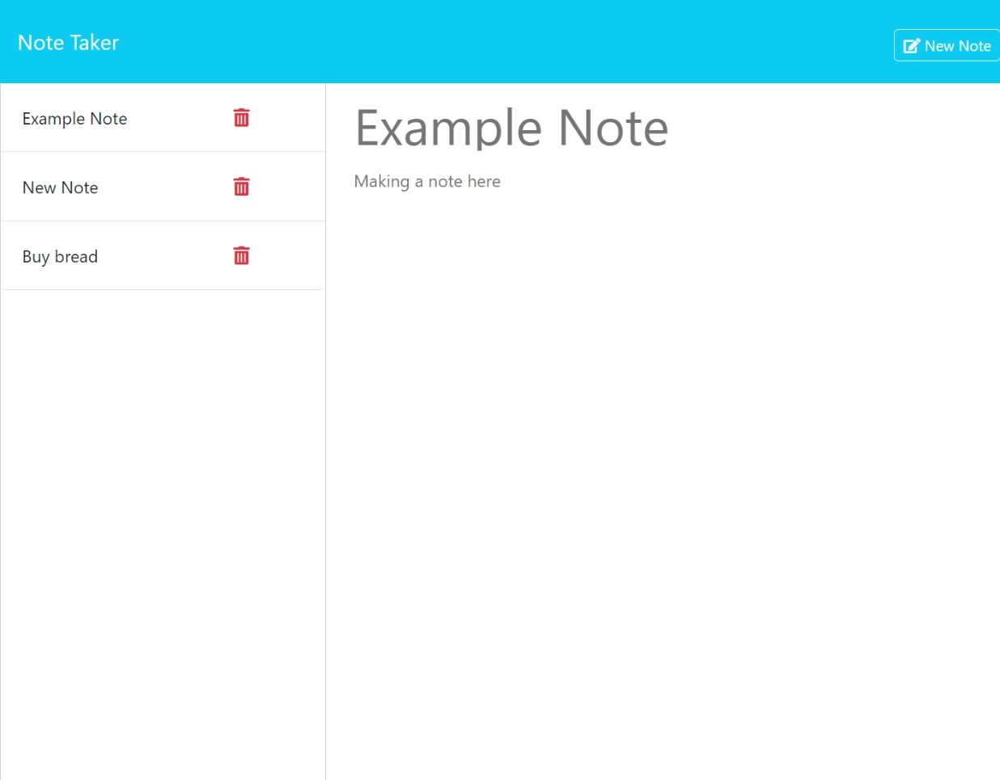

# Note Taker

## Description

Note Taker is an application designed to write and save notes.  This application uses an Express.js back end and is designed to save and retrieve note data from a JSON file. 

Link to site: [https://fierce-spire-82930-4aa67cc276ab.herokuapp.com/](https://fierce-spire-82930-4aa67cc276ab.herokuapp.com/)

## Usage
From the index, the user can continue to the notes page by clicking the `Get Started` button or navigating to `/notes`. 

Previous notes can be viewed by clicking on the corresponding title on the column on the left side of the screen.  From a prior note, we can navigate to the new note form by clicking the `New Note` button that appears on the top right of the window.

To create a new note, the column on the right side can be updated with a title and text, and the note can be saved by pressing the `Save Note` button that appears on the top right of the window.

The `Clear Form` button on the top right of the screen will remove the text on an unsaved note.